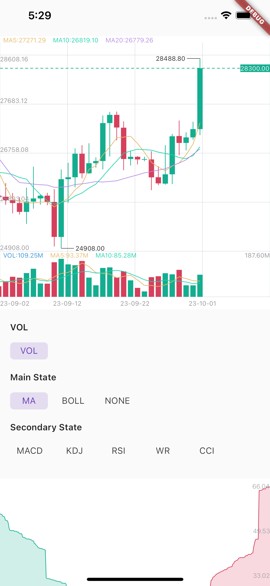
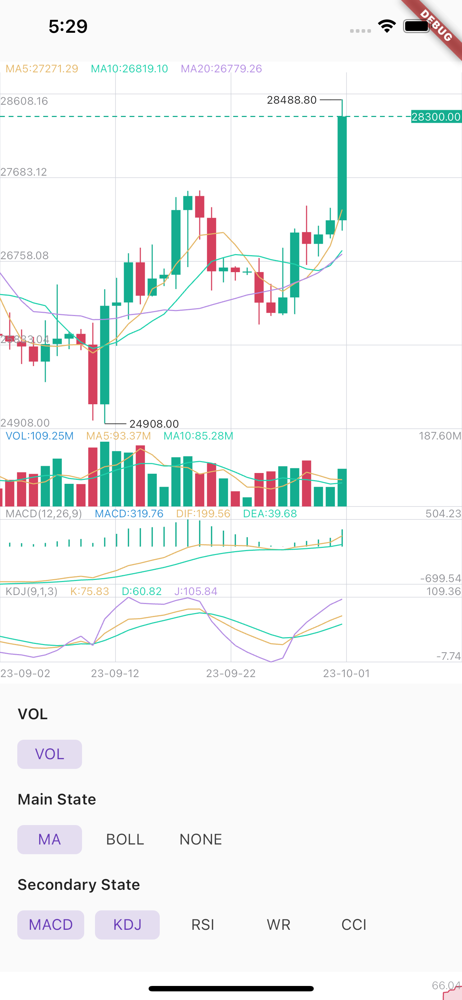

# Candle Chart

## Feature


Maybe this is the best candle chart in Flutter.Support drag,scale,long press,fling.And easy to use.

|         Example1          |         Example2          |
|:-------------------------:|:-------------------------:|
|  |  |

## Installation

First, add `candle_chart` as
a [dependency in your pubspec.yaml file](https://flutter.dev/using-packages/).

```yaml
candle_chart:
  git:
    url: https://github.com/skyoption/chart-dart.git  
```

## Usage

**When you change the data, you must call this:**

```dart
DataUtil.calculate
(
datas
); //This function has some optional parameters: n is BOLL N-day closing price. k is BOLL param.
```

### Use K line chart

```dart
KChartWidget
(
chartStyle, // Required for styling purposes
chartColors,// Required for styling purposes
datas,// Required，Data must be an ordered list，(history=>now)
mBaseHeight: 360, //height of chart (not contain Vol and Secondary) 
isLine: isLine,// Decide whether it is k-line or time-sharing
mainState: _mainState,// Decide what the main view shows
secondaryStateLi: _secondaryStateLi,// Decide what the sub view shows
fixedLength: 2,// Displayed decimal precision
timeFormat: TimeFormat.YEAR_MONTH_DAY,
onLoadMore: (bool a) {},// Called when the data scrolls to the end. When a is true, it means the user is pulled to the end of the right side of the data. When a
// is false, it means the user is pulled to the end of the left side of the data.
maDayList: [5,10,20],// Display of MA,This parameter must be equal to DataUtil.calculate‘s maDayList
volHidden: false,// hide volume
showNowPrice: true,// show now price
isOnDrag: (isDrag){},// true is on Drag.Don't load data while Draging.
isTrendLine: false, // You can use Trendline by long-pressing and moving your finger after setting true to isTrendLine property. 
xFrontPadding: 100 // padding in front
),
```

### Use Depth chart

```dart
DepthChart
(_bids, _asks, chartColors) //Note: Datas must be an ordered list，
```

### Dark | Light Theme

`ChartColor` helped to set the color for the chart. You need to flexibly change according to your
theme configuration to ensure UI.

>
> If you need to apply multi theme, you need to change at least the colors related to the text,
> border, grid and background color
>

```dart

late ThemeData themeData = Theme.of(context);
late ChartColors chartColors = ChartColors(
  bgColor: themeData.colorScheme.background,
  defaultTextColor: themeData.textTheme.labelMedium?.color ?? Colors.grey,
  gridColor: themeData.dividerColor,
  hCrossColor: themeData.textTheme.bodyMedium?.color ?? Colors.white,
  vCrossColor: themeData.disabledColor.withOpacity(.1),
  crossTextColor: themeData.textTheme.bodyMedium?.color ?? Colors.white,
  selectBorderColor: themeData.textTheme.bodyMedium?.color ?? Colors.black54,
  selectFillColor: themeData.colorScheme.background,
  infoWindowTitleColor: themeData.textTheme.labelMedium?.color ?? Colors.grey,
  infoWindowNormalColor: themeData.textTheme.bodyMedium?.color ?? Colors.white,
);
```

Apply in k line chart:

```dart

KChartWidget
(
data,
ChartStyle(),
ChartColors().init(), ///custom chart color
chartTranslations: ChartTranslations(
date: 'Date'
open: 'Open',
high: 'High',
low: 'Low',
close: 'Close'
changeAmount: 'Change',
change: 'Change%',
amount: 'Amount',
vol: 'Volume',
),
mBaseHeight: 360,
isTrendLine: false,
mainState: mainState,
secondaryStateLi: secondaryStates,
fixedLength: 2,
timeFormat
:
TimeFormat
.
YEAR_MONTH_DAY
,
);
```

